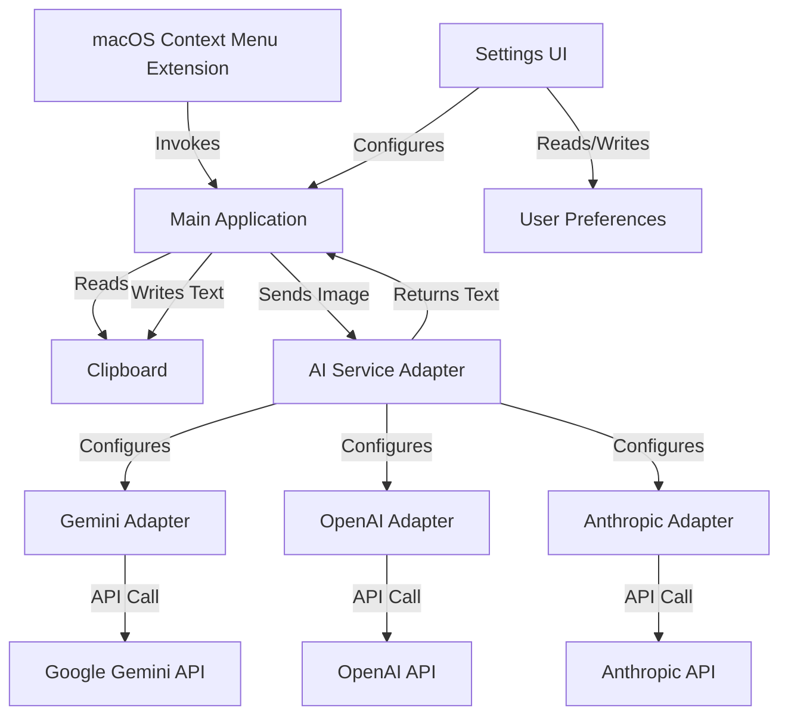
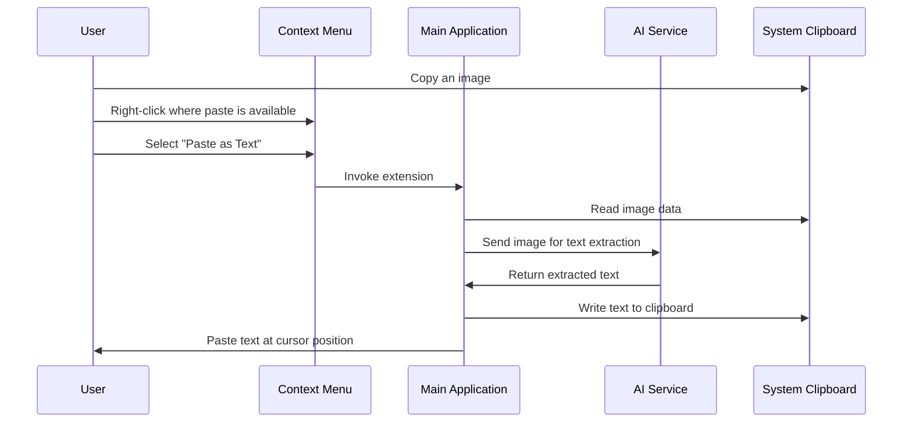

# Paste as Text - Architecture

## System Overview

The "Paste as Text" macOS extension adds a new option to context menus where "paste" appears, allowing users to extract text from images in the clipboard using AI services.

## Component Architecture

## Key Components

### 1. macOS Context Menu Extension

- **Type**: Action Extension
- **Purpose**: Adds "Paste as Text" option to context menus
- **Activation**: Only enabled when clipboard contains an image
- **Behavior**: Invokes main application to process the image

### 2. Main Application

- **Type**: Swift application (AppKit/SwiftUI)
- **Purpose**: Coordinates the core functionality
- **Responsibilities**:
  - Reading images from clipboard
  - Coordinating with AI services
  - Writing extracted text back to clipboard
  - Managing user preferences

### 3. AI Service Adapter

- **Design Pattern**: Strategy Pattern / Adapter Pattern
- **Purpose**: Provides a common interface for different AI services
- **Initial Implementation**: Google Gemini
- **Future Implementations**: OpenAI, Anthropic, etc.

### 4. Settings UI

- **Type**: macOS Preferences Pane
- **Purpose**: Allows users to configure the extension
- **Integration**: System Preferences/Settings app

### 5. User Preferences Storage

- **Non-sensitive Settings**: UserDefaults (`~/Library/Preferences/[bundle-id].plist`)
- **API Keys**: macOS Keychain

## User Flow

## Design Patterns

1. **Adapter Pattern**: Used for AI service integration to provide a common interface
2. **Strategy Pattern**: Allows switching between different AI services
3. **Repository Pattern**: For settings storage and retrieval
4. **Dependency Injection**: For testability and flexibility

## Domain Model

- **ImageContent**: Entity representing an image from the clipboard
- **ExtractedText**: Value object representing the immutable result of OCR
- **AIServiceConfiguration**: Value object for service configuration
- **AIServiceManager**: Aggregate root managing all AI service adapters

## Technical Constraints

- Must work with macOS security model and entitlements
- Must handle various image formats from clipboard
- Must gracefully handle API rate limits and errors
- Must provide good user experience despite network latency

## Future Architecture Considerations

- Potential for local OCR processing to reduce API dependencies
- Possible expansion to handle more complex document structures
- Consideration for cross-device synchronization of settings