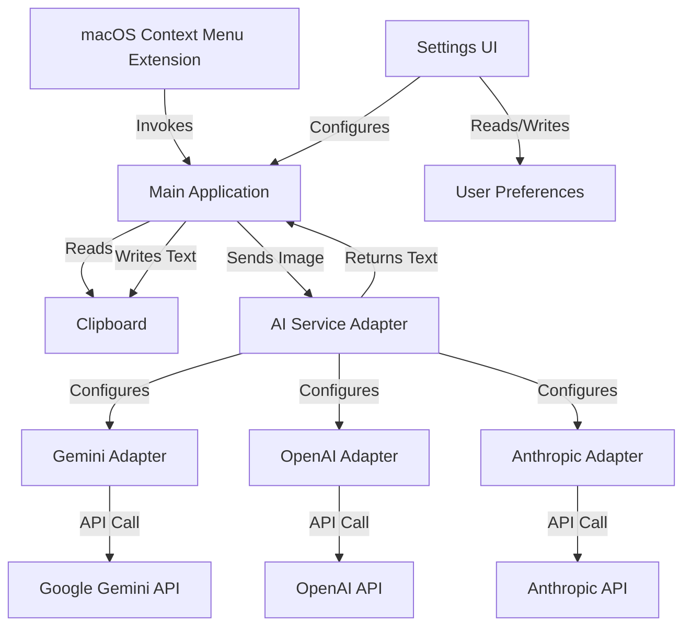
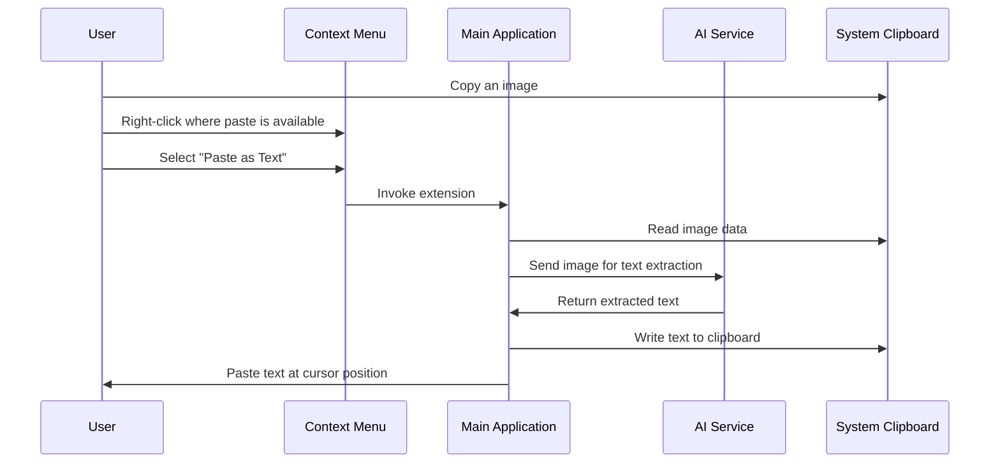

# Paste as Text - Project Plan

## 1. System Architecture



## 2. Component Breakdown

### 2.1 macOS Context Menu Extension

- **Technology**: macOS App Extension (specifically a Share Extension or Action Extension)
- **Purpose**: Add "Paste as Text" option to context menus where "Paste" appears
- **Behavior**: 
  - Only enabled when clipboard contains an image
  - When selected, passes control to the main application

### 2.2 Main Application

- **Technology**: Swift application using AppKit/SwiftUI
- **Purpose**: Core functionality coordinator
- **Components**:
  - Clipboard Manager: Read images from and write text to clipboard
  - AI Service Manager: Coordinate with the appropriate AI service
  - Configuration Manager: Handle user preferences

### 2.3 AI Service Adapter

- **Design Pattern**: Strategy Pattern / Adapter Pattern
- **Purpose**: Abstract the differences between AI services
- **Initial Implementation**: Google Gemini adapter
- **Future Adapters**: OpenAI, Anthropic, etc.
- **Common Interface**:
  ```swift
  protocol AIServiceAdapter {
      func extractTextFromImage(_ image: NSImage) async throws -> String
      // Configuration methods
  }
  ```

### 2.4 Settings UI

- **Technology**: macOS Preferences Pane
- **Purpose**: Allow users to configure the extension
- **Settings**:
  - AI Service selection (Gemini, OpenAI, Anthropic)
  - API Keys management
  - OCR preferences (language, confidence threshold)
  - Advanced options (timeout, retries, etc.)

### 2.5 User Preferences Storage

- **Technology**: macOS UserDefaults and Keychain
- **Storage Locations**:
  - Non-sensitive settings: `~/Library/Preferences/[bundle-id].plist`
  - API Keys: macOS Keychain

## 3. Development Methodology

### 3.1 Domain-Driven Design (DDD)

The project will follow DDD principles to ensure the code structure reflects the business domain:

- **Bounded Contexts**: 
  - Context Menu Extension
  - AI Service Integration
  - Settings Management
  - Clipboard Management

- **Ubiquitous Language**: Establish a common vocabulary for all components:
  - "Paste as Text" - The core action
  - "AI Service" - The OCR provider
  - "Extraction" - The process of getting text from images

- **Entities and Value Objects**:
  - `ImageContent` (Entity): Represents an image from the clipboard
  - `ExtractedText` (Value Object): Immutable result of OCR
  - `AIServiceConfiguration` (Value Object): Configuration for a service

- **Aggregates and Repositories**:
  - `AIServiceManager` (Aggregate Root): Manages all AI service adapters
  - `PreferencesRepository`: Handles storage and retrieval of settings

### 3.2 Test-Driven Development (TDD)

The project will follow TDD principles:

1. **Testing Framework**: XCTest for unit tests, with XCUITest for UI testing
   - XCTest is Apple's native testing framework and integrates well with Xcode
   - For more expressive tests, we'll use Quick and Nimble libraries

2. **Test Types**:
   - **Unit Tests**: Test individual components in isolation
   - **Integration Tests**: Test interactions between components
   - **UI Tests**: Test the user interface and user flows

3. **TDD Process**:
   - Write tests first that define the expected behavior
   - Run tests to confirm they fail (Red)
   - Implement the minimum code to make tests pass (Green)
   - Refactor code while keeping tests passing (Refactor)
   - Repeat for each feature

4. **Mocking Strategy**:
   - Use protocol-based design to enable easy mocking
   - Create mock implementations of AI services for testing
   - Use dependency injection to swap real implementations with mocks

### 3.3 KISS and DRY Principles

- **KISS (Keep It Simple, Stupid)**:
  - Favor simple, straightforward implementations
  - Avoid premature optimization
  - Use standard macOS APIs and patterns where possible
  - Minimize dependencies on third-party libraries

- **DRY (Don't Repeat Yourself)**:
  - Extract common functionality into shared utilities
  - Use protocols and extensions to share behavior
  - Create reusable components for common UI elements
  - Establish consistent patterns across the codebase

## 4. Project Structure

```
/
├── README.md                 # Project overview and structure
├── plans/                    # Project planning documents
├── src/                      # Source code
│   ├── app/                  # Main application
│   │   ├── AppDelegate.swift
│   │   ├── main.swift
│   │   └── ...
│   ├── extension/            # Context menu extension
│   │   ├── ActionRequestHandler.swift
│   │   └── ...
│   ├── settings/             # System Preferences integration
│   │   ├── PreferencePane.swift
│   │   └── ...
│   ├── services/             # AI service adapters
│   │   ├── AIServiceAdapter.swift  # Protocol
│   │   ├── GeminiAdapter.swift
│   │   ├── OpenAIAdapter.swift
│   │   └── ...
│   ├── domain/               # Domain model (DDD)
│   │   ├── entities/
│   │   ├── value_objects/
│   │   └── ...
│   └── utils/                # Utility functions
│       ├── ClipboardManager.swift
│       └── ...
├── tests/                    # Test files
│   ├── unit/                 # Unit tests
│   ├── integration/          # Integration tests
│   └── ui/                   # UI tests
├── resources/                # Static resources
│   ├── icons/
│   └── ...
├── docs/                     # Additional documentation
├── scripts/                  # Build and deployment scripts
│   ├── build_dmg.sh
│   └── ...
└── memory-bank/              # Project memory bank
    ├── architecture.md
    ├── technical-details.md
    ├── future-plans.md
    ├── issues.md
    └── decisions.md
```

## 5. Implementation Plan

### Phase 1: Foundation and Gemini Integration

1. **Create Basic macOS App**
   - Set up Xcode project with appropriate entitlements
   - Implement clipboard reading/writing functionality
   - Create basic UI shell

2. **Implement Google Gemini Integration**
   - Create Gemini API client
   - Implement image-to-text functionality
   - Add error handling and retry logic

3. **Create Context Menu Extension**
   - Implement extension that appears in paste context
   - Add logic to detect image in clipboard
   - Connect extension to main app functionality

4. **Basic Settings UI**
   - Create preferences pane in System Preferences
   - Implement API key storage in Keychain
   - Add basic configuration options

### Phase 2: Enhanced Features and Additional AI Services

1. **Refactor for Multiple AI Services**
   - Implement adapter interface
   - Refactor Gemini implementation to use adapter
   - Add OpenAI adapter implementation
   - Add Anthropic adapter implementation

2. **Enhanced Settings UI**
   - Add service selection UI
   - Implement service-specific configuration options
   - Add advanced settings

3. **Performance Optimizations**
   - Implement caching for repeated OCR requests
   - Add background processing for large images
   - Optimize memory usage

### Phase 3: Polish and Distribution

1. **User Experience Improvements**
   - Add progress indicators
   - Implement error messages and recovery options
   - Add keyboard shortcuts

2. **Testing and Validation**
   - Test with various image types and content
   - Validate across different macOS versions
   - Performance testing

3. **Distribution Preparation**
   - Create DMG package
   - Prepare user instructions for security warnings
   - Documentation

## 6. CI/CD with GitHub Actions

### 6.1 GitHub Actions Workflow

We'll set up a GitHub Actions workflow to automate building and packaging the application without requiring an Apple Developer account:

```yaml
name: Build and Package

on:
  push:
    branches: [ main ]
  pull_request:
    branches: [ main ]
  workflow_dispatch:

jobs:
  build:
    runs-on: macos-latest
    
    steps:
    - uses: actions/checkout@v3
    
    - name: Set up Xcode
      uses: maxim-lobanov/setup-xcode@v1
      with:
        xcode-version: latest-stable
    
    - name: Install dependencies
      run: |
        brew install create-dmg
    
    - name: Build application
      run: |
        xcodebuild -project PasteAsText.xcodeproj -scheme PasteAsText -configuration Release -derivedDataPath build
    
    - name: Create DMG
      run: |
        mkdir -p dist
        create-dmg \
          --volname "Paste as Text" \
          --volicon "resources/icons/AppIcon.icns" \
          --window-pos 200 120 \
          --window-size 800 400 \
          --icon-size 100 \
          --icon "Paste as Text.app" 200 190 \
          --hide-extension "Paste as Text.app" \
          --app-drop-link 600 185 \
          "dist/PasteAsText.dmg" \
          "build/Release/Paste as Text.app"
    
    - name: Upload DMG artifact
      uses: actions/upload-artifact@v3
      with:
        name: PasteAsText-DMG
        path: dist/PasteAsText.dmg
```

### 6.2 Release Automation

For tagged releases, we'll add an additional job to create a GitHub release:

```yaml
  release:
    needs: build
    if: startsWith(github.ref, 'refs/tags/')
    runs-on: ubuntu-latest
    
    steps:
    - name: Download DMG artifact
      uses: actions/download-artifact@v3
      with:
        name: PasteAsText-DMG
        path: ./
    
    - name: Create Release
      uses: softprops/action-gh-release@v1
      with:
        files: PasteAsText.dmg
        body: |
          # Paste as Text Release
          
          ## Installation Instructions
          
          1. Download the DMG file
          2. Open the DMG file
          3. Drag the application to your Applications folder
          4. When launching for the first time, right-click and select "Open"
          5. Click "Open" when prompted about the unidentified developer
```

### 6.3 Unsigned DMG Considerations

Since we're building without an Apple Developer account:

- The DMG and application will be unsigned
- Users will see Gatekeeper warnings when installing
- We'll include clear instructions for users on how to bypass these warnings
- The CI/CD pipeline will include these instructions in the release notes

## 7. Technical Details

### 7.1 macOS Extension Types

For our context menu extension, we have two main options:

1. **Action Extension**: 
   - Appears in the Services menu
   - Can be configured to appear in context menus
   - More flexible but requires more setup

2. **Share Extension**:
   - Appears in Share menus throughout macOS
   - Simpler to implement but more limited in scope

For our use case, an **Action Extension** is likely more appropriate as it can be configured to appear specifically in paste context menus.

### 7.2 Clipboard Handling

macOS provides several APIs for clipboard interaction:

```swift
// Reading an image from clipboard
if let image = NSPasteboard.general.readObjects(forClasses: [NSImage.self], options: nil)?.first as? NSImage {
    // Process image
}

// Writing text to clipboard
NSPasteboard.general.clearContents()
NSPasteboard.general.setString(extractedText, forType: .string)
```

### 7.3 AI Service Integration

For Google Gemini, we'll use their official Swift SDK or REST API:

```swift
// Example Gemini API call (simplified)
func extractTextFromImage(_ image: NSImage) async throws -> String {
    guard let imageData = image.tiffRepresentation else {
        throw AIServiceError.invalidImageFormat
    }
    
    let base64Image = imageData.base64EncodedString()
    
    // Prepare request to Gemini API
    let request = GeminiRequest(
        model: "gemini-pro-vision",
        contents: [
            Content(parts: [
                Part(text: "Extract all visible text from this image"),
                Part(inlineData: InlineData(
                    mimeType: "image/jpeg",
                    data: base64Image
                ))
            ])
        ]
    )
    
    // Send request and process response
    let response = try await geminiClient.generateContent(request)
    return response.text
}
```

### 7.4 Settings Storage

For storing settings, we'll use:

1. **UserDefaults** for general settings:
```swift
// Reading settings
let selectedService = UserDefaults.standard.string(forKey: "selectedAIService") ?? "gemini"

// Writing settings
UserDefaults.standard.set("openai", forKey: "selectedAIService")
```

2. **Keychain** for API keys:
```swift
// Saving API key to Keychain
func saveAPIKey(_ key: String, forService service: String) {
    let query: [String: Any] = [
        kSecClass as String: kSecClassGenericPassword,
        kSecAttrService as String: "com.yourapp.PasteAsText",
        kSecAttrAccount as String: service,
        kSecValueData as String: key.data(using: .utf8)!,
        kSecAttrAccessible as String: kSecAttrAccessibleWhenUnlocked
    ]
    
    SecItemDelete(query as CFDictionary)
    SecItemAdd(query as CFDictionary, nil)
}
```

### 7.5 System Preferences Integration

To integrate with macOS System Preferences:

```swift
// In Info.plist
<key>NSPrefPaneIconFile</key>
<string>PrefPaneIcon.icns</string>
<key>NSPrefPaneIconLabel</key>
<string>Paste as Text</string>

// Main class
@objc(PasteAsTextPreferencePane)
class PasteAsTextPreferencePane: NSPreferencePane {
    override func mainViewDidLoad() {
        super.mainViewDidLoad()
        // Setup UI
    }
}
```

## 8. User Experience Flow



## 9. Configuration UI Design

The System Preferences pane will have the following sections:

1. **General Settings**
   - AI Service selection (dropdown)
   - Language preferences
   - Behavior options (auto-paste, notifications)

2. **API Configuration**
   - Service-specific API key inputs
   - Endpoint configuration (for self-hosted options)
   - Rate limiting settings

3. **Advanced Settings**
   - OCR confidence threshold
   - Timeout and retry settings
   - Debug logging options

## 10. Potential Challenges and Mitigation Strategies

### 10.1 Technical Challenges

| Challenge | Description | Mitigation Strategy |
|-----------|-------------|---------------------|
| **macOS Security Restrictions** | macOS has strict security policies for extensions and clipboard access | - Thoroughly research required entitlements<br>- Test early with actual extension implementation<br>- Follow Apple's security guidelines |
| **AI Service Rate Limits** | Free tier of Gemini has rate limits | - Implement caching for repeated OCR requests<br>- Add rate limiting in the app<br>- Provide clear error messages when limits are reached |
| **Image Format Compatibility** | Different image formats on clipboard | - Test with various image formats<br>- Implement format conversion as needed<br>- Provide fallback mechanisms |
| **Large Image Processing** | Large images may cause performance issues | - Implement image resizing before API calls<br>- Add progress indicators for user feedback<br>- Consider background processing |
| **API Changes** | AI services may change their APIs | - Abstract API calls behind adapters<br>- Monitor for API changes<br>- Design for easy updates |

### 10.2 User Experience Challenges

| Challenge | Description | Mitigation Strategy |
|-----------|-------------|---------------------|
| **Gatekeeper Warnings** | Users will see warnings for unsigned app | - Provide clear installation instructions<br>- Include visual guides for bypassing Gatekeeper<br>- Consider future code signing options |
| **OCR Accuracy** | AI services may not perfectly extract text | - Allow users to adjust confidence thresholds<br>- Provide feedback mechanism for poor results<br>- Consider post-processing options |
| **Configuration Complexity** | Multiple AI services with different settings | - Design intuitive UI with sensible defaults<br>- Provide tooltips and help text<br>- Implement progressive disclosure of advanced options |
| **Performance Perception** | API calls introduce latency | - Add progress indicators<br>- Consider background processing<br>- Implement caching for repeated requests |

### 10.3 Distribution Challenges

| Challenge | Description | Mitigation Strategy |
|-----------|-------------|---------------------|
| **Unsigned Application** | Without Developer ID, app will be flagged | - Document bypass process clearly<br>- Consider future options for signing<br>- Provide alternative installation methods |
| **Updates Distribution** | Delivering updates to users | - Implement update checking mechanism<br>- Use GitHub releases for distribution<br>- Consider Sparkle framework for updates |
| **Cross-Version Compatibility** | Supporting multiple macOS versions | - Test on different macOS versions<br>- Document minimum requirements<br>- Use availability checks for version-specific APIs |

## 11. Future Enhancements

### 11.1 Advanced OCR Features

- **Format Preservation**: Maintain formatting like tables, lists, and paragraphs
- **Layout Analysis**: Intelligently reconstruct document layout
- **Handwriting Recognition**: Improve support for handwritten text
- **Multi-language Support**: Detect and extract text in multiple languages
- **Image Preprocessing**: Automatic image enhancement before OCR
- **Custom Extraction Rules**: Allow users to define regions of interest or exclusion

### 11.2 Integration Enhancements

- **System-wide Keyboard Shortcut**: Add global hotkey for quick access
- **Contextual Menu Customization**: Allow users to customize where the option appears
- **Application-specific Settings**: Configure different behavior for different applications
- **Batch Processing**: Process multiple images at once
- **Drag and Drop Support**: Allow dragging images directly onto the app icon
- **Services Menu Integration**: Add to macOS Services menu

### 11.3 AI Service Enhancements

- **Local OCR Options**: Add offline processing using models like Tesseract
- **Hybrid Approach**: Use local OCR for speed, cloud for accuracy
- **Custom Prompting**: Allow users to customize the prompts sent to AI services
- **Result Comparison**: Compare results from multiple services
- **Specialized Models**: Use domain-specific models for technical documents, receipts, etc.
- **Self-hosted Options**: Support for self-hosted open-source models

### 11.4 User Experience Improvements

- **History Feature**: Keep a history of recently processed images and results
- **Result Editing**: Allow users to edit extracted text before pasting
- **Text Formatting Options**: Control how text is formatted when pasted
- **Accessibility Improvements**: Enhanced VoiceOver support and keyboard navigation
- **Dark Mode Support**: Proper dark mode implementation for all UI elements
- **Localization**: Translate the app into multiple languages

### 11.5 Advanced Configuration

- **Profiles**: Save and switch between different configuration profiles
- **Cloud Sync**: Sync settings across multiple devices
- **Command Line Interface**: Add CLI for automation and scripting
- **AppleScript Support**: Allow scripting the application
- **Shortcuts App Integration**: Create actions for Apple Shortcuts
- **Advanced Logging**: Detailed logging for troubleshooting

### 11.6 Enterprise Features

- **Team Sharing**: Share API keys and settings within a team
- **Admin Controls**: Centralized management for enterprise deployment
- **Usage Analytics**: Track usage patterns and performance
- **Custom AI Integration**: Support for enterprise-specific AI services
- **Network Proxy Support**: Work in corporate environments with proxies
- **License Management**: Enterprise licensing options

## 12. Memory Bank Structure

The memory bank will consist of the following markdown files:

### 12.1 architecture.md

Documents the overall system architecture:
- Component diagram
- Interaction flows
- Design patterns used
- Key architectural decisions

### 12.2 technical-details.md

Contains implementation details:
- API integration specifics
- macOS extension implementation
- Clipboard handling
- Settings storage approach

### 12.3 future-plans.md

Outlines planned enhancements:
- Prioritized feature roadmap
- Technical debt to address
- Research areas
- Long-term vision

### 12.4 issues.md

Tracks known issues and challenges:
- Current bugs and limitations
- Workarounds
- Investigation notes
- Priority levels

### 12.5 decisions.md

Records key decisions made during development:
- Decision points
- Options considered
- Rationale for choices
- Impact assessment

This memory bank structure will help maintain context across development sessions and provide a quick reference for understanding the project's current state and future direction.